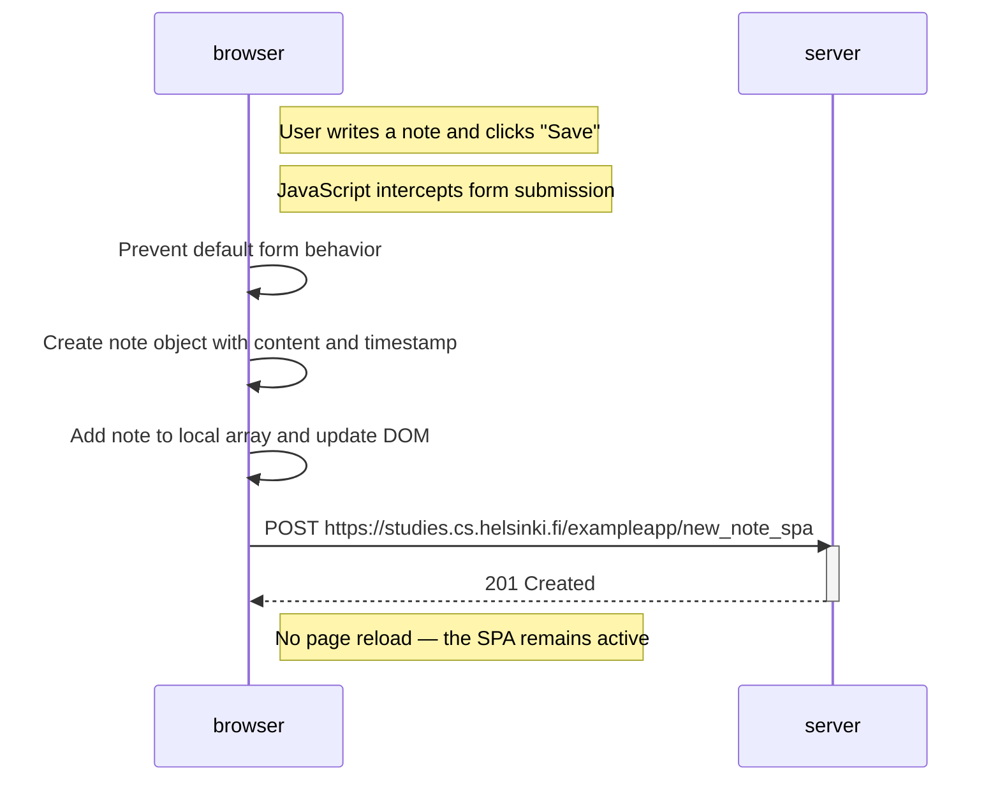

```mermaid
sequenceDiagram
    participant browser
    participant server

    Note right of browser: User writes a note and clicks "Save"
    Note right of browser: JavaScript intercepts form submission

    browser->>browser: Prevent default form behavior
    browser->>browser: Create note object with content and timestamp
    browser->>browser: Add note to local array and update DOM

    browser->>server: POST https://studies.cs.helsinki.fi/exampleapp/new_note_spa
    activate server
    server-->>browser: 201 Created
    deactivate server

    Note right of browser: No page reload — the SPA remains active
```